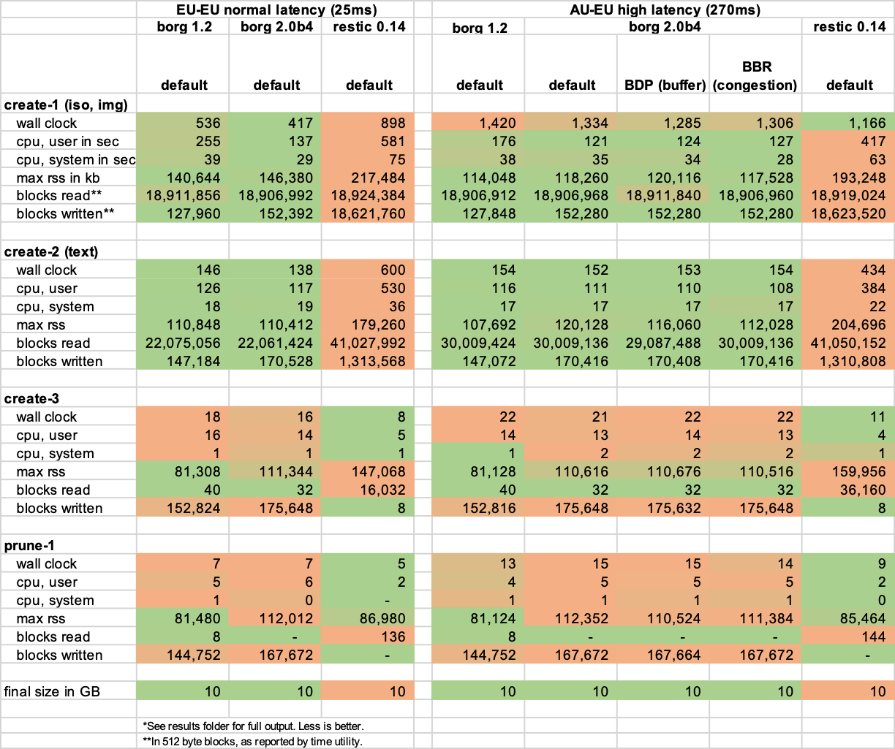

# Backup Benchmarks

## Test v2 (Dec 2022)

### Goals
- Compare Borg 1.2 to Borg 2.0 on older and newer Python versions, as well as Restic.
- Compare normal- and high latency connections.
- Compare BDP and BBR network optimizations.


### Key findings:
- Borg 2.0 with Python 3.11 is about 5 to 20% faster on normal- and high latency connections, uses less CPU and about the same memory. The difference was smaller, when the focus was on compression.
- CPU time is drastically lower for Borg 2.0. As much as 30%, unless more compression is involved.
- Final backup size was the same for Borg 1.2 and 2.0, 10% more for Restic with default settings, when using the same Zstdandard compression.
- Restic took 2-4x longer for new backups and took ~2x memory. It's also reading and writing much more data than Borg.
- Restic is slightly faster when no data has changed or on a high latency connection. The latter may be due to using 5 parallel upload connections.
- Network optimizations to deal with high-bandwidth/high latency connections yielded only small speed improvements (BBR and BDP)
- Results were relatively stable across multiple runs of the same scenario.



Benchmark subjects:
- "classic" Borg on older Python: [Github](https://github.com/borgbackup/borg/releases/download/1.2.2/borg-linux64)
- "new" Borg on Python 3.11: [Github](https://github.com/borgbackup/borg/releases/download/2.0.0b4/borg-linux64)
- Restic on Go: [Github](https://github.com/restic/restic/releases/download/v0.14.0/restic_0.14.0_linux_amd64.bz2)

Methodology
- Backup target: BorgBase server in EU region, off-peak hour
- Backup client specs:
    - 1 Core, 30GB SSD Storage, 1GB Memory, 1G network
    - VPS hosted with OneProvider in Sydney and Nuremberg
- Test data: 19.5 GB total, 43921 files
    - Corpus part 1:
        - [ubuntu-22.10-desktop-amd64.iso](https://releases.ubuntu.com/kinetic/ubuntu-22.10-desktop-amd64.iso), 3.8 GB
        - [Visual Genome](http://visualgenome.org/api/v0/api_home.html), images part 2, 5.5 GB
    - Corpus part 2:
        - [wikidatawiki-20221201-pages-articles-multistream10.xml-p13998368p15498367.bz2](https://dumps.wikimedia.org/wikidatawiki/20221201/wikidatawiki-20221201-pages-articles-multistream10.xml-p13998368p15498367.bz2), uncompressed, 11 G
- Test tasks:
    - initial backup of corpus part 1 (create-1)
    - subsequent backup with corpus part 2 added (create-2)
    - subsequent backup without new data (create-3)
    - pruning 50% (prune-1)
- Measurements taken by [GNU Time](https://www.gnu.org/software/time/):
    - Time: wall clock
    - CPU usage: user time, system time
    - Final backup size: in GB
    - Memory usage: max RSS
    - File system inputs: Data read in blocks of 512 bytes
    - File system outputs: Data written in blocks of 512 bytes

Test Scenarios
- normal latency: backup nearby server with connection in Germany, 25ms ping
- high latency: backup server on high latency connection in Australia, 270ms ping
- high latency with optimized BBR
- high latency with optimized BDP


Test machine setup
- OS: Debian GNU/Linux 11 (bullseye)
- Initial setup steps:
    ```
    apt update && apt install -y tmux time rsync nload ncdu
    ssh-keygen -o -a 100 -t ed25519
    echo 'StrictHostKeyChecking accept-new' > ~/.ssh/config
    ```

Test commands
- Results will be written to `results` folder.
- See `tests.sh` or `results` folder for full commands.

```
source tests.sh

export BORG_REPO=ssh://...
export RESTIC_REPOSITORY=rest:https://...

test_borg-12
test_borg-20
test_restic-14
```


## Test v1 (Oct 2022)

Test combinations of Python and Borg versions locally using the built-in benchmark command. Uses pyenv to set up different versions and virtualenvs. See [here](https://borgbackup.readthedocs.io/en/stable/usage/benchmark.html) for more.


## About BorgBase

[BorgBase](https://www.borgbase.com) offers simple and secure backup storage for open source backup tools, like Borg and Restic. Manage all your backup repositories in one place via web interface or API. Monitor usage, quotas and security settings, and choose to be alerted about stale backups. Every repo is isolated, encrypted and optionally append-only to protect against ransomware attacks.

